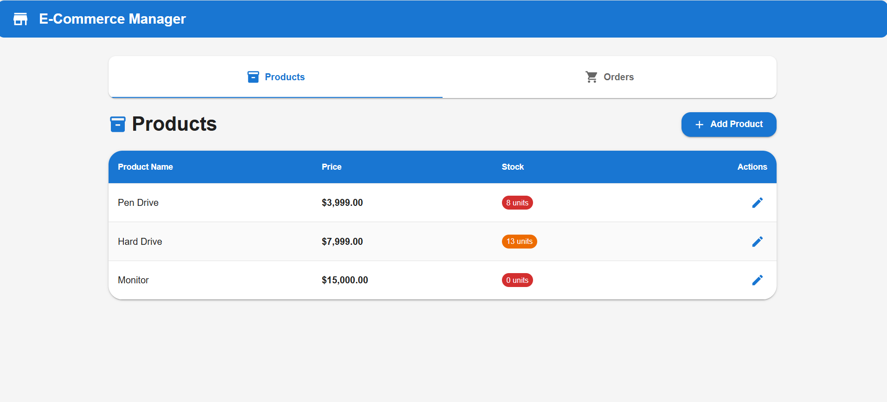
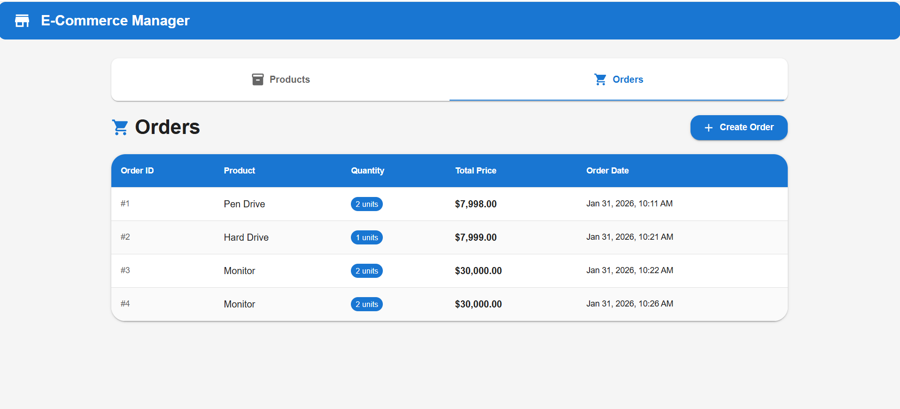
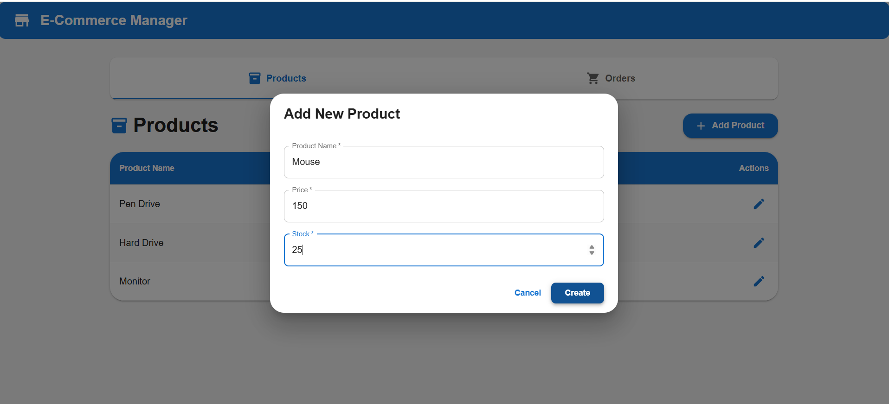
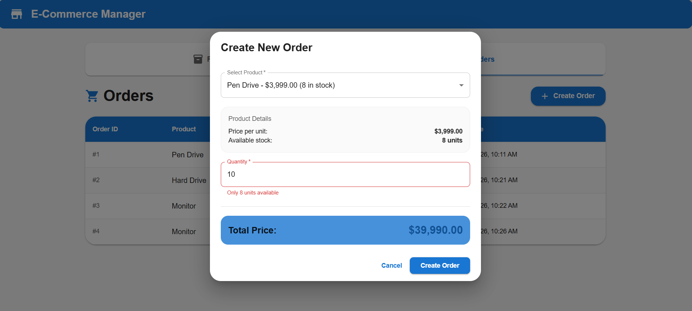

# 🚀 Full-Stack Application (React + .NET Core)

A full-stack e-commerce web application built with **React (Vite)** for the frontend and **ASP.NET Core Web API** for the backend.

---

## 🧱 Tech Stack

### Frontend
- React
- Vite
- JavaScript / TypeScript
- Axios
- Material UI

### Backend
- ASP.NET Core Web API
- Entity Framework Core
- SQL Server
- Swagge
- C#

## ⚛️ Frontend Setup (React + Vite)

### Step 1️⃣ Navigate to frontend directory
```bash
cd frontend/e-commerce-web
```

### Step 2️⃣ Install dependencies
```bash
npm install
```

### Step 3️⃣ Configure environment variables
```bash
Create a .env file inside the frontend folder paste your local backend api url:

VITE_API_URL=https://localhost:7105/api
```

### Step 4️⃣ Start the frontend development server
```bash
npm run dev
```

## Screenshots





